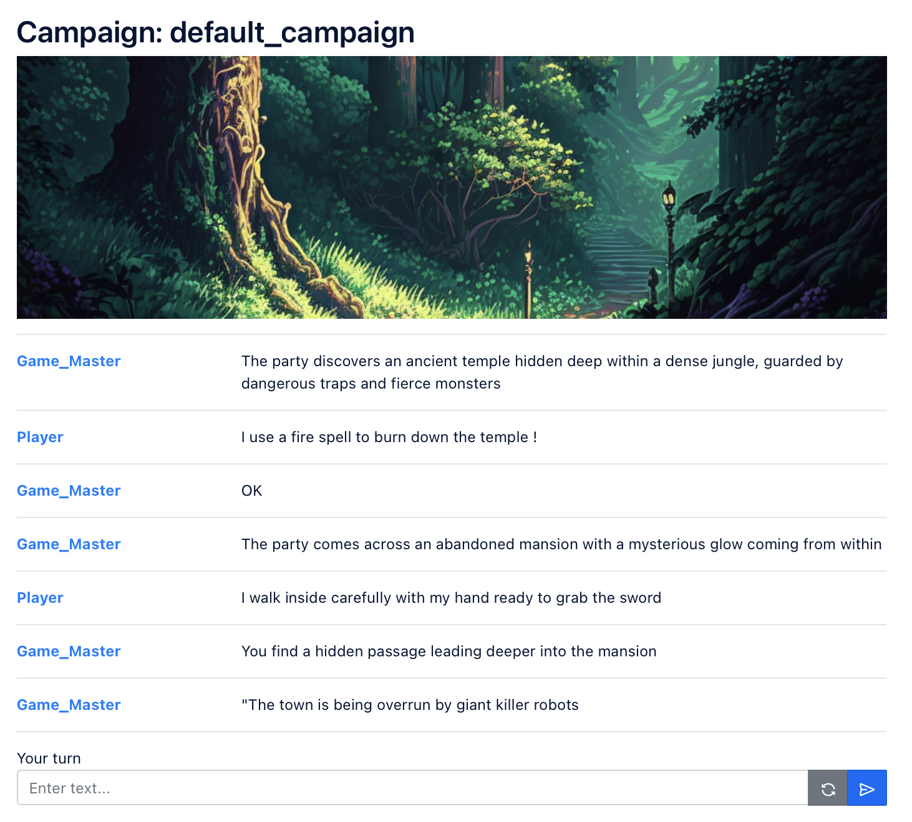

# React Llama Chat

This project is a React application that works in conjunction with a separate project for the FastAPI backend. It includes a game that uses a local language model to generate text.

## Introduction


This project combines a React frontend and a FastAPI backend to create an interactive game that utilizes a local language model for text generation. The React app serves as the user interface, allowing players to interact with the game, while the FastAPI backend handles the game logic and communication with the language model.

## Prerequisites

Make sure you have the following prerequisites installed:

-   Node.js (version 14.17.0 or higher)

## Installation

1. Clone the repository:

```shell
git clone https://github.com/Sebastian-Pages/fastapi-chat-llama.git
```

2. Install the dependencies for the React app:

```shell
cd react-app
npm install
```

3. Start the React app:

```shell
npm run dev
```

Access the React app in your browser at http://localhost:3000.
Note: In order to run the complete application, you will also need to set up and run the FastAPI backend project. Please refer to the separate documentation for the backend project for installation and usage instructions.

## Features

Interactive Gameplay: Engage in an interactive game experience where the text is generated using a local language model.
React User Interface: Utilize a user-friendly React interface to play the game and interact with the generated text.
FastAPI Backend: This project requires a separate FastAPI backend to handle game logic and communication with the language model.

## License

This project is licensed under the MIT License.
